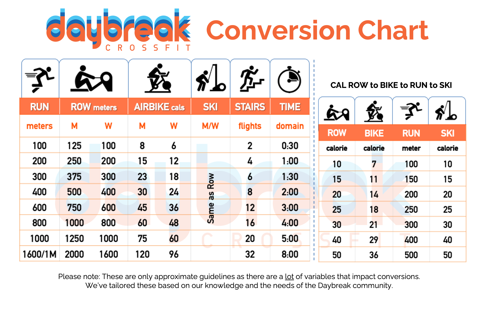
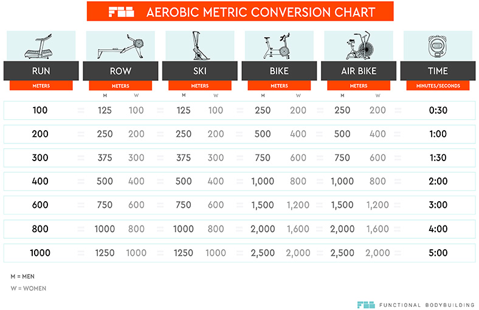

# Training-Conversions
### About
A conversion program for when you want to convert forms of exercise.
### Extended Version
Have you ever injured a leg, but needed to run to burn off calories? Well, you might have used tables like these to figure out how much the usual amount of meters you run is equivalent to in rowing meters, bike meters, or even flight stairs:

Well, with this script, you won't have to anymore. Built with the Tkinter module in Python, Train Conversions takes input from the user and uses mathematical equations to figure out the conversions for you. It has a nice GUI and perfect functionality.

### Sources

To understand the mathematical equations required for the script, I used the tables attached above. The first one is made by Daybreak Crossfit and the second table is made by Functional Bodybuilding. I used the first chart for running meters, rowing meters, and flight stairs, whilst I used the second chart for bike meters.
